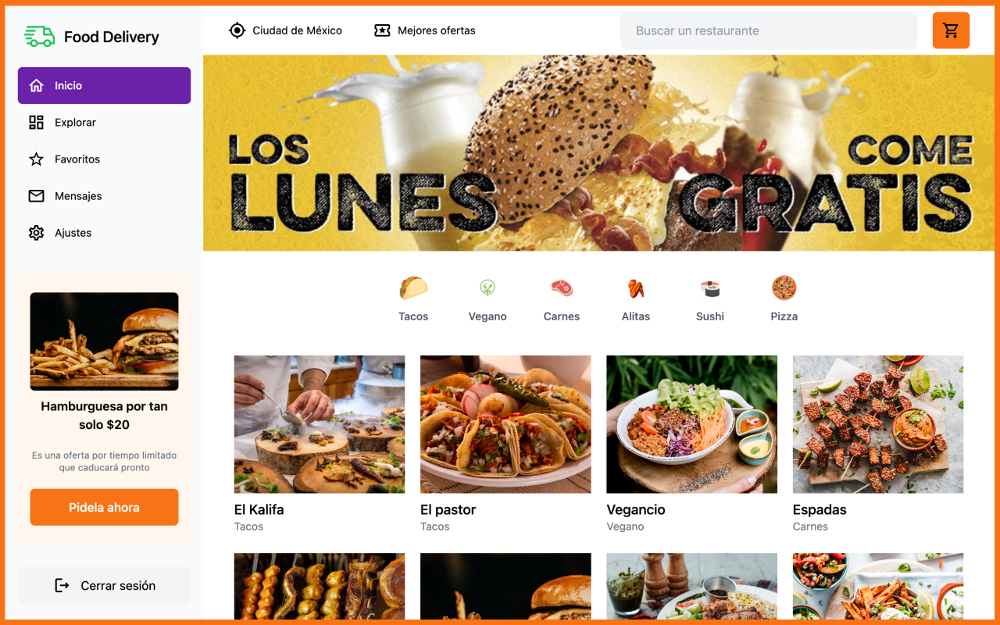
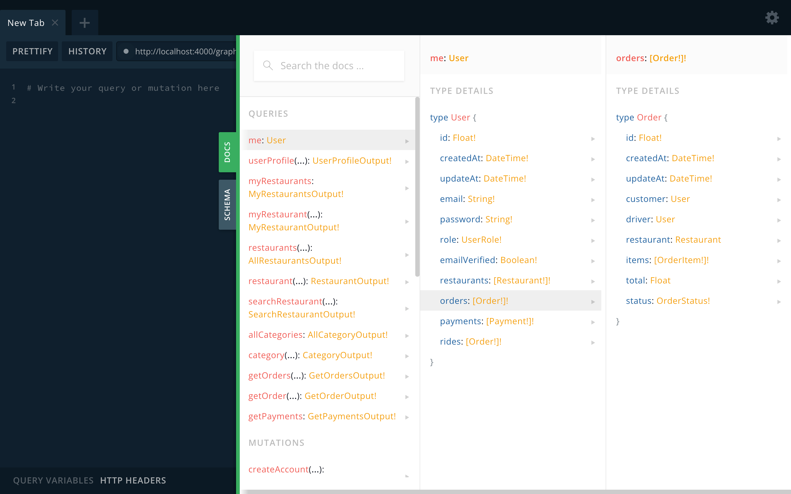

<div align="center">
  <h1>Nestjs - Food Delivery Backend</h1>


<p>Food delivery application based on the concept of uber, rappi, etc... In which you can register as a customer, owner or delivery person and depending on your profile you can register your restaurant for the sale of food, help deliver orders and order what you like the most.</p>

</div>

### Preview



## The project

Backend built mainly to be consumed by the frontend application made with react that you can find in
the following link: [react-food-delivery](https://github.com/DavidBarcenas/react-food-delivery).

## Features

- Personalized mailing
- Account confirmation
- Use of graphql and apollo server
- Web sockets with Graphql
- Handlebears for mail templates
- Postgress with TypeORM
- Tasks schedules
- Linters and prettier config
- Email confirmation
- Docker to create the database

## Installation

To clone and run this application, you'll need Git and Node.js installed on your computer. Optional
you can install Yarn.

From your command line:

```bash
# Clone this repository
$ git clone https://github.com/DavidBarcenas/food-delivery-backend.git

# Go into the repository
$ cd food-delivery-backend

# Install dependencies
$ npm install
```

You must have [docker](https://www.docker.com/get-started/) installed to create and run the
database.

```bash
# It will create the database container
$ docker-compose up

# If you see the message below in your terminal, the container was created successfully.
database system is ready to accept connections
```

To connect to the database you can use a tool like [DBeaver](https://dbeaver.io/) or the one you
prefer. The data you need for the connection can be found and configured in the
**docker-compose.yml** file.

In any case, I leave you the commands in case you want to see the tables from your terminal.

```bash
# First you have to access the container
docker exec -it <container-name> psql -U <username> <database>

# If you accessed correctly you will see this change in your terminal
food_delivery=#

# Then run the following command to list the tables (you can run any PSQL-Query you like)
\dt

# e.g. food_delivery=# \dt
# The output of the above command
                 List of relations
 Schema |          Name          | Type  |
--------+------------------------+-------+
 public | category               | table |
 public | dish                   | table |
 public | email_verification     | table |
 public | order                  | table |
 public | order_item             | table |
 public | payment                | table |
 public | restaurant             | table |
 public | typeorm_metadata       | table |
 public | u
```

## Development

Starts the application in development mode with active code reloading, bug reports, and more.

For the application to run properly don't forget to add your **.env.dev, .env.prod and .env.test
files** in the root of the project (at the same level as the src folder).

```bash
# development
$ npm run start

# development and watch mode
$ npm run start:dev

# production mode
$ npm run start:prod
```

_Sometimes when you get an error in terminal like file not found, it can be fixed by removing the
**dist** folder from the root. Or, you can also run the command `npm run prebuild`_

After successfully running the application, you can go to
[http://localhost:4000/graphql](http://localhost:4000/graphql) to interact with the graphql
playground.



## Test

```bash
# Unit tests
$ npm run test

# e2e tests
$ npm run test:e2e

# Test coverage
$ npm run test:cov
```

## Notes

Don't forget to set your environment variables. In the project there is a file called
**.env.dev.example** there it has all the variables you will need.

# License

Released under the [MIT licensed](LICENSE).\
Feel free to fork this project and improve it. Give a ⭐️ if you like this project!
